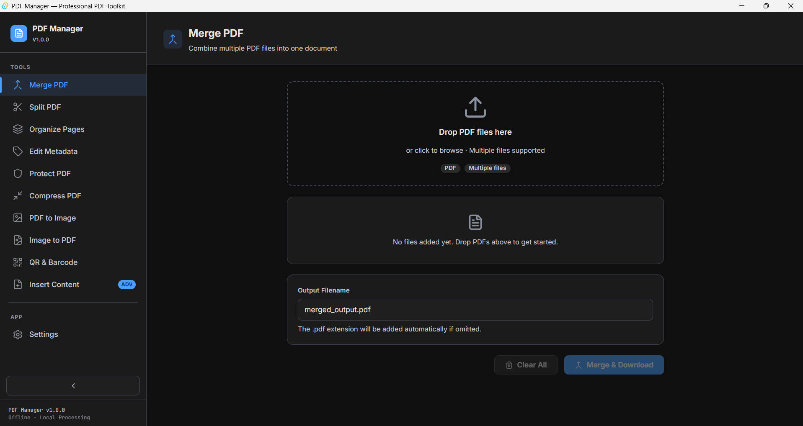
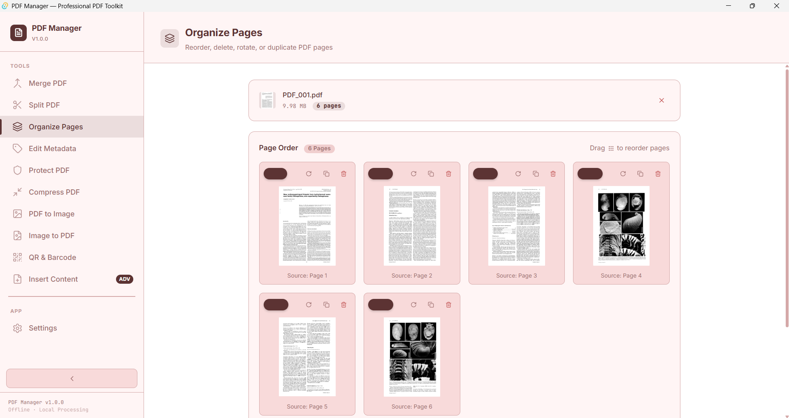
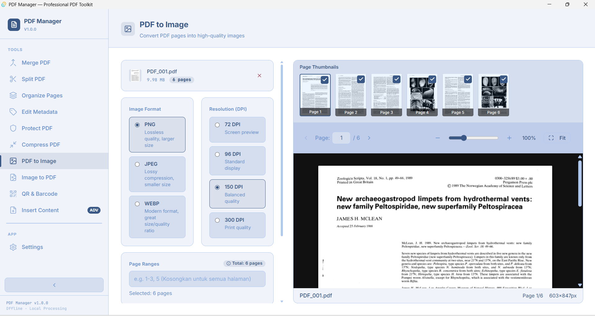
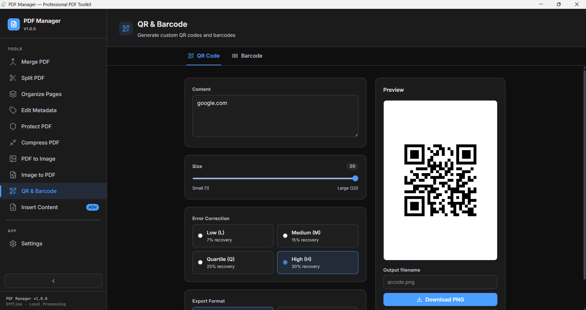

# PDF Manager


<p align="center">
  
</p>

<p align="center">
  <strong>An offline desktop application for professional PDF document processing.</strong><br/>
  Built with Tauri + React + FastAPI.
</p>

<p align="center">
  
  
  
  
</p>

---

## ✨ Features

| Feature | Description |
|-------|-----------|
| 📎 **Merge PDF** | Combine multiple PDF files into one using drag & drop |
| ✂️ **Split PDF** | Split a PDF or extract specific pages into separate files |
| 🗜️ **Compress PDF** | Reduce PDF file size with adaptive image compression |
| 🖼️ **PDF to Image** | Export PDF pages to PNG, JPEG, or WEBP formats |
| 📄 **Image to PDF** | Convert images (JPG/PNG/WEBP/BMP) into a single PDF |
| 🔲 **QR & Barcode** | Generate QR codes and barcodes (Code128, EAN13, EAN8, Code39) |
| 📌 **Insert Content** | Insert PDF pages or images into an existing PDF document |
| 🗂️ **Organize Pages** | Rearrange, delete, or rotate PDF pages |
| 🏷️ **Edit Metadata** | Edit title, author, subject, and other PDF properties |
| 🔒 **Protect/Unlock PDF** | Protect PDFs with a password or remove existing passwords |

> **All processing runs 100% offline on your machine. Your files are never sent to the internet. Temporary files are automatically cleaned up.**

---

## 🛠️ Tech Stack

| Layer | Technology | Version |
|-------|-----------|-------|
| Desktop Shell | Tauri | 2.11.2 |
| Frontend | React + TypeScript | 19 + TS 6 |
| Build Tool | Vite | 8.0 |
| Styling | Tailwind CSS | 4.3 |
| Icons | lucide-react | 1.17 |
| Router | React Router | 7.16 |
| HTTP Client | Axios | 1.16 |
| Backend | FastAPI | 0.136 |
| ASGI Server | Uvicorn | 0.48 |
| PDF Engine | PyMuPDF (fitz) | 1.27 |
| Image Processing | Pillow | 12.2 |
| QR Code | qrcode | 8.2 |
| Barcode | python-barcode | 0.16 |
| Validation | Pydantic / pydantic-settings | 2.13 |
| Python Env | uv venv | 0.11.17 |
| Rust | rustc / cargo | 1.96.0 |

---

## 📸 Screenshots

<p align="center">
  
  
  <br>
  
  
</p>

---

## 🔨 Build from Source

### Prerequisites

- **Python 3.11+** — [python.org](https://python.org)
- **Node.js 18+** — [nodejs.org](https://nodejs.org)
- **Rust 1.77+** — [rustup.rs](https://rustup.rs)
- **uv** — `pip install uv`

### 1. Clone the repository

```bash
git clone https://github.com/hubble99/pdf-manager.git
cd pdf-manager
```

### 2. Setup the backend

```powershell
cd backend
uv venv
uv pip install -r requirements.txt --python .venv\Scripts\python.exe
```

### 3. Setup the frontend

```powershell
cd frontend
npm install
```

### 4. Run in development mode

```powershell
# Terminal 1 — Backend
cd backend
.venv\Scripts\uvicorn main:app --host 127.0.0.1 --port 8000 --reload

# Terminal 2 — Frontend
cd frontend
npm run dev
```

Open `http://localhost:5173` in your browser, OR if you want to run via the Tauri desktop shell:

```powershell
# Terminal 3 — Tauri App
# Ensure Rust is in your PATH:
$env:Path = [System.Environment]::GetEnvironmentVariable("Path","Machine") + ";" + [System.Environment]::GetEnvironmentVariable("Path","User")

cd frontend
npm run tauri:dev
```

### 5. Build the Python sidecar executable

```powershell
cd backend
uv pip install pyinstaller --python .venv\Scripts\python.exe
& .venv\Scripts\python.exe -m PyInstaller build.spec --clean --noconfirm
# Output will be located at: backend/dist/pdf-manager-backend.exe
```

### 6. Build the Tauri production installer

```powershell
# Copy the sidecar to the Tauri binaries folder
copy backend\dist\pdf-manager-backend.exe `
     frontend\src-tauri\binaries\pdf-manager-backend-x86_64-pc-windows-msvc.exe

# Build the installer
$env:Path = [System.Environment]::GetEnvironmentVariable("Path","Machine") + ";" + [System.Environment]::GetEnvironmentVariable("Path","User")
cd frontend
npm run tauri build
```

The output installers will be located at: `frontend/src-tauri/target/release/bundle/`

---

## 📦 Installation Guide (End User)

1. Download `PDF Manager_1.0.0_x64-setup.exe` from the [Releases](../../releases) page.
2. Follow the installation wizard.
3. Launch the app from **Start Menu → PDF Manager**.

### System Requirements
- Windows 10 / 11 (64-bit)
- Minimum 4 GB RAM
- Minimum 500 MB Storage

---

## ⚠️ Windows SmartScreen Warning

When installing PDF Manager for the first time, Windows SmartScreen may show a warning saying *"Windows protected your PC"*. This is expected behavior for open-source apps without an expensive code signing certificate.

**To proceed with installation:**
1. Click **"More info"** on the SmartScreen dialog
2. Click **"Run anyway"**
3. Installation will proceed normally

PDF Manager is fully open-source. You can review the entire source code in this repository.

---

## 🧪 Testing

```powershell
# Backend tests
cd backend
.venv\Scripts\python.exe -m pytest tests/ -v

# Frontend tests
cd frontend
npm run test

# TypeScript type check
cd frontend
npx tsc --noEmit
```

---

## 🎨 Design Themes

**Pro-Level Document Interface**
- Provides 3 themes: Dark, Dusty Rose, and Steel Blue.
- Clean typography and professional styling tailored for document workflows.

---

## 📄 License

MIT License — free to use, modify, and distribute.

---

## 🙏 Acknowledgements

- [PyMuPDF](https://pymupdf.readthedocs.io/) — PDF rendering engine
- [Tauri](https://tauri.app/) — Desktop shell framework
- [FastAPI](https://fastapi.tiangolo.com/) — Backend API framework
- [React](https://react.dev/) — UI framework
